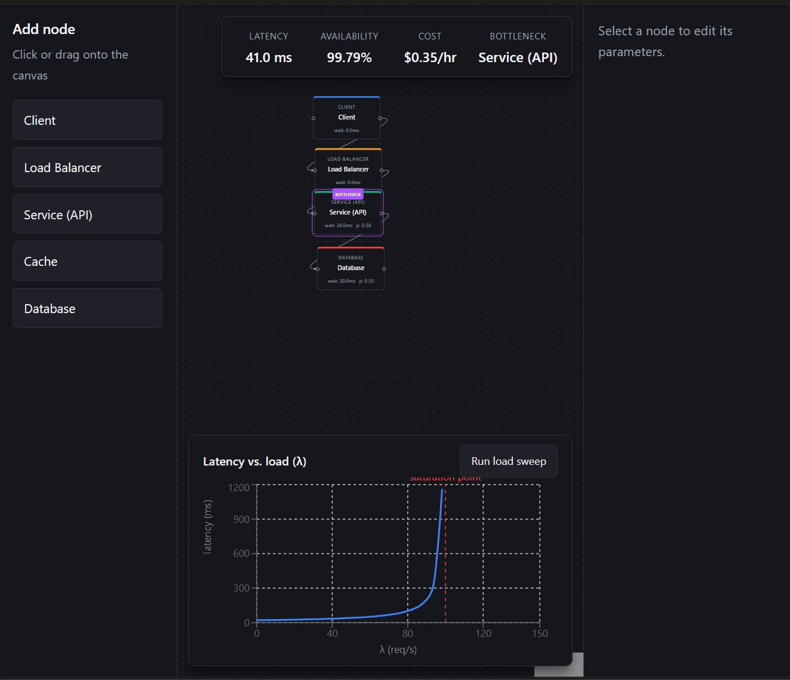

# System Design Simulator

An interactive tool for modeling distributed system architectures and estimating their performance. Drag infrastructure components onto a canvas, connect them into a request path, and get real-time estimates of **latency, throughput, availability, and cost** — backed by an actual **M/M/1 queueing model**, not hand-waved numbers.

Built to make system-design trade-offs visible: watch a database saturate as traffic climbs, then fix it by adding replicas or a cache and see the numbers respond.



> _Add your screenshot at `docs/latency-chart.png`. The load-sweep chart above is the centerpiece: latency stays flat, then explodes as arrival rate approaches the bottleneck's service rate._

---

## What it does

- **Visual architecture builder** — drag-and-drop canvas (Client, Load Balancer, Service, Cache, Database) with editable per-node parameters.
- **Real queueing simulation** — each node is modeled as an M/M/1 queue; the engine computes per-node utilization and wait time, end-to-end latency, and system availability.
- **Live bottleneck detection** — the busiest node is flagged automatically; nodes glow amber as they near saturation and red once utilization hits 1.0.
- **Load-sweep analysis** — sweep the arrival rate from zero to past saturation and plot the latency curve, showing the non-linear blow-up characteristic of queueing systems.
- **System metrics panel** — end-to-end latency, availability (as a path-product), total cost, and the current bottleneck, all updating in real time.

## The model

Traffic (arrival rate **λ**, requests/sec) enters at the Client and flows along the edges. Each request-handling node has a service rate **μ**, a replica count, an availability, and a unit cost.

For each node, given its incoming arrival rate:

- **Utilization:** `ρ = (λ / replicas) / μ`
- **Wait time (M/M/1):** `W = 1 / (μ − λ/replicas)` — which grows without bound as `ρ → 1`
- **In-flight requests (Little's Law):** `L = λ · W`

At the system level:

- **End-to-end latency** = sum of wait times along a series path; parallel branches take the max, not the sum.
- **Availability** = product of node availabilities along the critical path, where a node with N replicas has availability `1 − (1 − a)^N`.
- **Bottleneck** = the node with the highest utilization (or the first to reach `ρ ≥ 1`).

A **Cache** node passes only the misses downstream (`λ · (1 − hit_ratio)`), which is how it relieves a saturating database — visible immediately as the database's utilization drops.

## Tech stack

**Backend**
- FastAPI (Python 3.12)
- Pure, side-effect-free simulation engine in `backend/engine/simulator.py`
- Pydantic for request validation
- pytest for the engine test suite

**Frontend**
- React + Vite
- React Flow for the interactive canvas
- Recharts for the load-sweep visualization

**Design choices worth noting**
- All simulation math lives in the backend engine as pure functions — the frontend never computes, it only displays. This keeps a single source of truth and makes the core model unit-testable.
- The engine is validated by a pytest suite covering the saturation edge case, the cache-reduces-load behavior, replica scaling, Little's Law, cycle detection, and parallel-branch latency.

## Running locally

**Backend**

```powershell
cd backend
python -m venv venv
.\venv\Scripts\Activate.ps1  # Windows (PowerShell)
# source venv/bin/activate   # macOS / Linux
pip install -r requirements.txt
uvicorn main:app --reload
```

The API runs at `http://localhost:8000` — interactive docs at `http://localhost:8000/docs`.

**Frontend**

```bash
cd frontend
npm install
npm run dev
```

The app runs at `http://localhost:5173`.

**Tests**

```bash
cd backend
pytest engine/ -v
```

## Try it

1. Build a path: **Client → Load Balancer → Service → Database**.
2. Leave the Service and Database at their defaults: Service μ = **200** (3 replicas), Database μ = **150** (2 replicas, so 300 req/s of total capacity).
3. Raise the Client's request rate toward **300** and watch the Database's utilization climb and its wait time blow up.
4. Past **300**, the Database saturates (glows red). Fix it two ways: add a third Database replica, or insert a Cache with an 80% hit ratio — either pulls it back out of saturation.
5. Hit **Run load sweep** to see the full latency-vs-load curve.

## Roadmap

- [ ] Save / load architectures (MongoDB persistence)
- [ ] LLM-generated architecture critique — diagnose the bottleneck and recommend fixes
- [ ] Preset architectures (monolith, cached web app, microservices)
- [ ] Async / message-queue node type

## API

| Endpoint | Method | Purpose |
|----------|--------|---------|
| `/health` | GET | Health check |
| `/simulate` | POST | Run the engine on a graph, return per-node and system metrics |
| `/sweep` | POST | Re-run the engine across a range of arrival rates for the load-sweep chart |

---

Built as a portfolio project exploring queueing theory, distributed-systems performance, and the trade-offs behind everyday architecture decisions.
